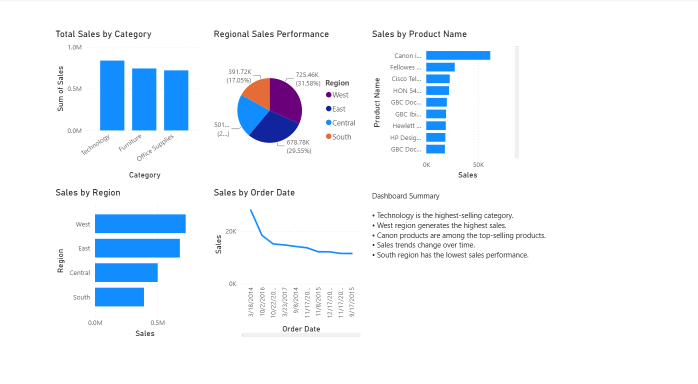

# Task 2: Data Visualization and Storytelling

## Objective
Create visualizations that convey a compelling business story using Power BI.

## Dataset
Superstore Sales Dataset

## Tool Used
- Power BI Desktop

## Dashboard Insights
- Technology is the highest-selling category.
- West region generates the highest sales.
- Canon products are among the top-selling products.
- Sales trends vary over time.
- South region has the lowest sales performance.

## Dashboard Preview

## Files Included
- Task-2-Sales-Dashboard.pbix
- Dashboard.png
- README.md

## Author
Kapa Sri Lakshmi
Data Analyst Intern – DataX Labs
